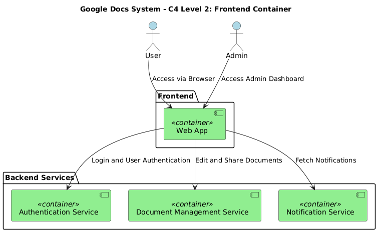
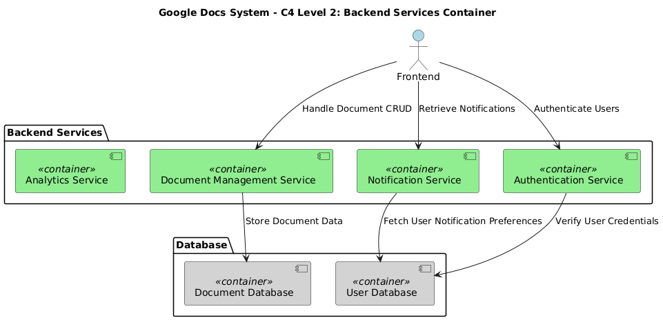
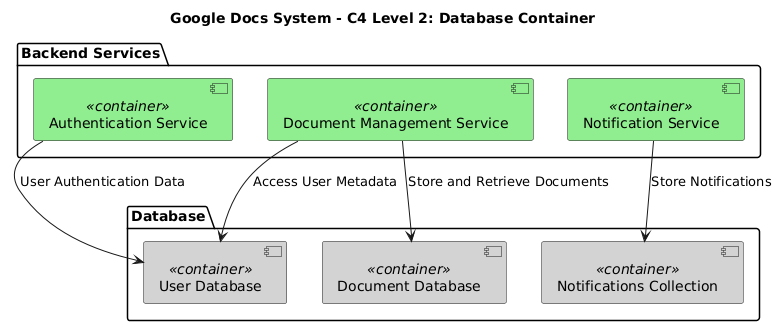
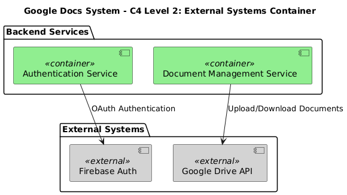
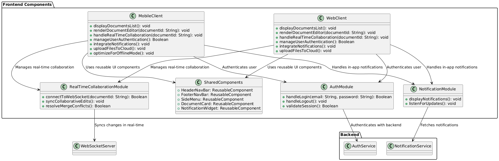
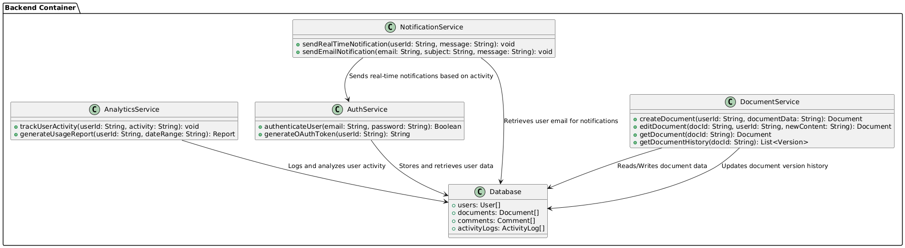
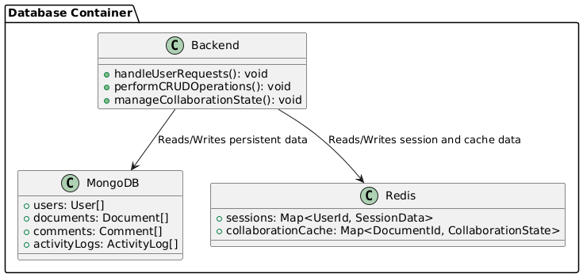
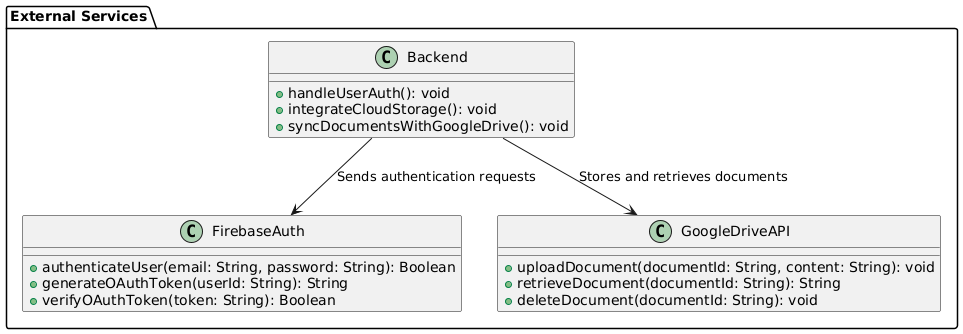
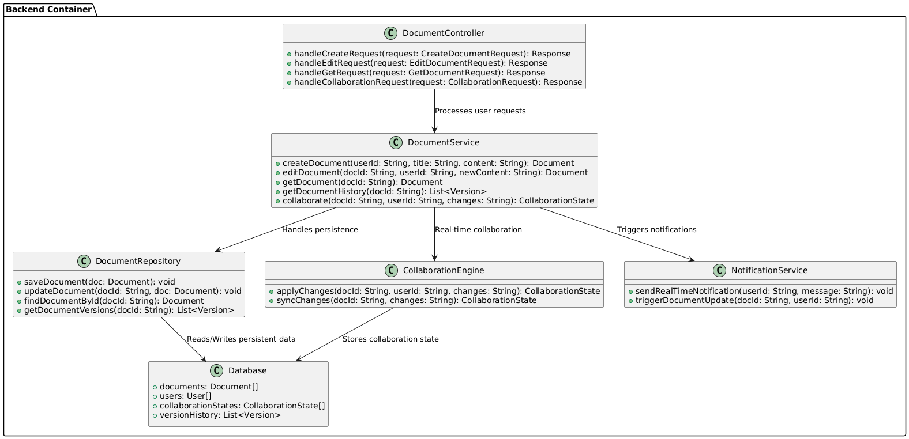
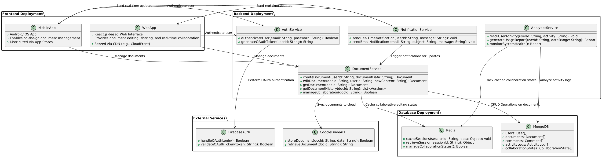

# System Context Diagram

# Container Diagrams
### Frontend Container Diagram

### Backend Container Diagram

### Database Conatiner Diagram

### External Service Diagram

# Component Diagrams
### Frontend Component Diagram

### Backend Component Diagram

### Database Component Diagram

### Extenal Services Component Diagram

# Code
### Backend Code Diagram

# Deployment Diagram

