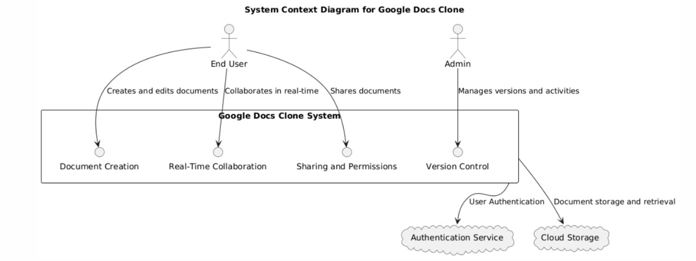

# System Context Diagram

### Image


### PlantUML Code

```plantuml
@startuml
!define RECTANGLE class

actor User
actor Admin
actor Developer

package "Web Client" {
  RECTANGLE "Web Application (UI)" as WebApp {
    WebApp : User Interface
    WebApp : Document Creation
    WebApp : Real-Time Collaboration
    WebApp : File Sharing
    WebApp : Commenting and Suggestions
    WebApp : Version History
  }
}

package "Server Side" {
  RECTANGLE "Backend API" as BackendAPI {
    BackendAPI : Handles requests from WebApp
    BackendAPI : User Authentication
    BackendAPI : Document Management
    BackendAPI : Collaboration Sync
    BackendAPI : Commenting & Suggestion Handling
    BackendAPI : Version History Management
  }

  RECTANGLE "Document Storage Service" as DocStorage {
    DocStorage : Stores user documents
    DocStorage : Version History Storage
  }

  RECTANGLE "Authentication Service" as AuthService {
    AuthService : Handles User Login/Registration
    AuthService : Multi-Factor Authentication
  }

  RECTANGLE "Notification Service" as NotificationService {
    NotificationService : Sends Notifications to Users
    NotificationService : Comments
    NotificationService : Document Changes
  }

  Admin --> BackendAPI : Manages users and platform
}

package "External Services" {
  RECTANGLE "Cloud Storage" as CloudStorage {
    CloudStorage : Provides document storage (e.g., AWS S3)
  }

  RECTANGLE "Third-Party Authentication" as ThirdPartyAuth {
    ThirdPartyAuth : OAuth / Firebase Auth for login
  }
}

User --> WebApp : Uses UI for document tasks
Admin --> WebApp : Manages platform
WebApp --> BackendAPI : Sends API requests
BackendAPI --> DocStorage : Accesses document data
BackendAPI --> AuthService : Verifies user identity
BackendAPI --> NotificationService : Sends notifications
DocStorage --> CloudStorage : Stores documents
AuthService --> ThirdPartyAuth : OAuth/Firebase Auth Integration
@enduml
