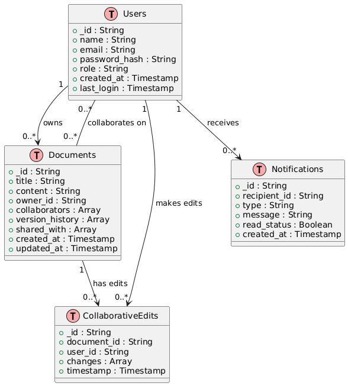

# Google Docs - Software Design Document

## 1. Introduction

### 1.1 Purpose
The purpose of this document is to provide a comprehensive design for the Google Docs system, detailing its architecture, database schema, and system components to ensure clarity and alignment among development teams.

### 1.2 Scope
Google Docs is a collaborative, cloud-based document management system that allows users to create, edit, share, and collaborate on documents in real-time. Key features include:

- **User functionalities:** Document creation, real-time collaboration, version management, and commenting.
- **Admin functionalities:** User management, monitoring activity, and maintaining system configurations.

### 1.3 Definitions, Acronyms, and Abbreviations
- **UI:** User Interface
- **API:** Application Programming Interface
- **S3:** Amazon Simple Storage Service
- **OAuth:** Open Authorization

---

## 2. System Overview

The system is a cloud-based, modular platform with three main layers:
1. **Presentation Layer:** User interface components for document management and collaboration.
2. **Business Logic Layer:** Backend services handling requests, document processing, and real-time updates.
3. **Data Layer:** Storage for documents, metadata, and logs.

---

## 3. Architectural Design

### 3 Architectural Style
The Google Docs system adopts a **microservices architecture** to ensure modularity, scalability, and maintainability. Each core function, such as authentication, document management, and notifications, is handled by distinct services with defined APIs. The system follows a **client-server model**, with a web-based frontend interacting with backend services via REST APIs and WebSockets (for real-time collaboration).

---

## Actors

### User

- **Role**: End users who interact with the system to create, edit, and share documents.  
- **Key Activities**:
  - Logging in or signing up.
  - Creating new documents.
  - Editing and collaborating in real-time.
  - Sharing documents via links or direct invitations.
  - Adding comments and viewing version histories.

### Admin

- **Role**: System administrators responsible for managing platform configurations, monitoring activity, and resolving issues.  
- **Key Activities**:
  - Managing user accounts (create, suspend, or delete).
  - Monitoring system activity and usage metrics.
  - Configuring platform settings, such as storage limits and permissions.
  - Generating reports on platform activity.

---

## System Components

### Frontend (Web-Based UI)

- **Description**:
  - A responsive, user-friendly interface built using React.js.
  - Provides access to Google Docs functionalities for users and admins.
- **Responsibilities**:
  - Rendering document editors and dashboards.
  - Supporting real-time collaboration with visual updates.
  - Providing tools for document sharing and role-based permissions.
- **Key Features**:
  - Text editing tools, commenting, and version tracking.
  - Sharing functionality for read and edit access.
  - Administrative dashboard for monitoring and management.

---

### Backend Services

#### Authentication Service
- **Responsibilities**:
  - Manages user login, registration, OAuth, and session tokens.
  - Secures access using Firebase Authentication.
  
#### Document Management Service
- **Responsibilities**:
  - Handles CRUD operations for documents.
  - Supports version history and real-time collaboration using operational transforms or CRDTs.

#### Notification Service
- **Responsibilities**:
  - Sends email and in-app notifications for document changes and comments.

#### Analytics Service
- **Responsibilities**:
  - Tracks user activity and generates insights for administrators.

- **Technologies**:
  - Node.js or Python-based microservices communicating via REST and WebSockets.

---

### Database

#### MongoDB
- Stores document content, user metadata, version histories, and collaboration data.

#### Redis
- Acts as an in-memory cache for session management and collaborative editing.

---

### External Systems

#### Firebase Authentication
- Provides secure user authentication using OAuth 2.0 and multi-factor authentication (MFA).
- Integrates with Google accounts and other third-party identity providers.

#### Google Drive API
- Manages cloud storage for documents, enabling seamless access and backups.

---

## 4. Interactions Between Components

### User Actions and System Flow
1. The user logs in through the frontend, which interacts with the Authentication Service.
2. On successful login, the frontend retrieves the user's documents and permissions via the Document Management Service.
3. Edits to a document are transmitted via WebSocket to the backend, processed, and broadcast to collaborators.
4. Notifications for comments or changes are generated and sent by the Notification Service.

### Admin Actions and System Flow
1. The admin logs into the dashboard to view system metrics.
2. The Analytics Service retrieves and aggregates data for display.
3. User management actions (e.g., suspensions) are processed by the Authentication and Document Management Services.

---

## 5. Data Design

### 5.1 Database Schema

#### **Users Collection**
| Field             | Type       | Description                           |
|-------------------|------------|---------------------------------------|
| _id               | String     | Unique identifier for the user        |
| name              | String     | User's name                           |
| email             | String     | User's email address                  |
| password_hash     | String     | Encrypted password                    |
| role              | String     | User role (e.g., admin/user)          |
| created_at        | Timestamp  | Timestamp of account creation         |
| last_login        | Timestamp  | Last login timestamp                  |

#### **Documents Collection**
| Field             | Type       | Description                           |
|-------------------|------------|---------------------------------------|
| _id               | String     | Unique identifier for the document    |
| title             | String     | Document title                        |
| content           | String     | Document content in HTML or JSON      |
| owner_id          | String     | User ID of the document owner         |
| collaborators     | Array      | List of user IDs with edit access     |
| version_history   | Array      | List of previous versions (timestamps, changes) |
| shared_with       | Array      | List of user IDs with view access     |
| created_at        | Timestamp  | Document creation timestamp           |
| updated_at        | Timestamp  | Last modified timestamp               |

#### **Collaborative Edits Collection**
| Field             | Type       | Description                           |
|-------------------|------------|---------------------------------------|
| _id               | String     | Unique identifier for the session     |
| document_id       | String     | Associated document ID                |
| user_id           | String     | User making the changes               |
| changes           | Array      | List of edit operations               |
| timestamp         | Timestamp  | Time of the edit                      |

#### **Notifications Collection**
| Field             | Type       | Description                           |
|-------------------|------------|---------------------------------------|
| _id               | String     | Unique identifier for the notification |
| recipient_id      | String     | User ID of the recipient              |
| type              | String     | Type of notification (e.g., comment, share) |
| message           | String     | Notification content                  |
| read_status       | Boolean    | Whether the notification was read     |
| created_at        | Timestamp  | Timestamp of notification creation    |

---

## 6. Interface Design

### 6.1 User Interfaces

#### **User Dashboard**
- Lists owned and shared documents
- Displays recent activity

#### **Admin Dashboard**
- Provides tools for managing users and monitoring system metrics

### 6.2 External Interfaces

#### **APIs**
- **Login Endpoint:** `/api/auth/login`
- **Document Endpoint:** `/api/documents`
- **Notification Endpoint:** `/api/notifications`

#### **Cloud Storage**
- Google Drive API for document uploads and downloads.

---

## 7. Detailed Design

### 7.1 Real-Time Collaboration
- Uses WebSocket for instant updates.
- Conflict resolution is managed using operational transforms.

### 7.2 Notifications
- **Email Service:** Sends account and activity updates.
- **In-App Notifications:** Alerts users of changes or comments.

---

## 8. Security Design
- **Authentication:** OAuth-based login through Firebase.
- **Data Encryption:** AES-256 for sensitive data.
- **Access Control:** Role-based access control (RBAC).

---

## 9. Non-Functional Requirements

1. **Scalability:** Supports 10,000+ concurrent users.
2. **Performance:** API response times under 200ms.
3. **Reliability:** 99.99% uptime.
4. **Security:** Regular vulnerability assessments to protect user data.

---

## 10. Appendix

### Glossary
- **CRUD:** Create, Read, Update, Delete
- **RBAC:** Role-Based Access Control
- **REST:** Representational State Transfer

### References
- [Google Docs API Documentation](https://developers.google.com/docs/api)
- [OAuth 2.0 Standard](https://oauth.net/2/)
