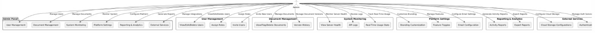

# Software Design Description (SDD)

## 1. Introduction

### 1.1 Purpose
The purpose of this document is to provide a comprehensive software design for the project, ensuring clarity on the system's architecture, components, and interactions.

### 1.2 Scope
This system is a platform that provides functionalities for both users and administrators. Key features include:
- *User functionalities:* Document creation, sharing, collaboration, and version management.
- *Admin functionalities:* User management, system monitoring, reporting, and platform configuration.

### 1.3 Definitions, Acronyms, and Abbreviations
- *UI:* User Interface
- *API:* Application Programming Interface
- *S3:* Amazon Simple Storage Service
- *OAuth:* Open Authorization

### 1.4 References
- [Project Requirements Document](Project_Requirements.md)
- [System Context Diagram](System_Context_Diagram.md)
- IEEE 1016-2009 Software Design Description Standard

---

## 2. System Overview

This system is a web-based platform built using a modular architecture. It has three core layers:
1. *Presentation Layer:* User interface components for end users and administrators.
2. *Business Logic Layer:* Backend services that process requests and manage business logic.
3. *Data Layer:* Handles storage of documents, user data, logs, and system configurations.

---

## 3. Architectural Design

### 3.1 Architectural Style
The system follows a *client-server architecture* with RESTful APIs and a microservices backend.

### 3.2 System Components
#### *Frontend (Web Client)*
- Framework: React.js
- Responsible for rendering UI, making API calls, and handling real-time updates.
- Features include:
  - Document editing and sharing
  - Real-time collaboration
  - Admin dashboard for system management

#### *Backend Services*
- *Authentication Service:* Handles login, registration, and OAuth integration.
- *Document Management Service:* Manages document CRUD operations and version history.
- *Notification Service:* Sends email and in-app notifications.
- *Analytics Service:* Generates reports and logs user activity.
- *Admin Management Service:* Provides admin tools for monitoring and configuration.

#### *Database*
- MongoDB: Stores user and document data.
- Redis: Handles caching for session management and real-time collaboration.

#### *External Services*
- AWS S3: Cloud storage for documents and backups.
- Firebase Auth: Third-party authentication for OAuth.

---

## 4. Component Diagram
### Diagram

---

## 5. Data Design

### 5.1 Database Schema
#### *Users Collection*
| Field            | Type    | Description               |
|-------------------|---------|---------------------------|
| _id            | String  | Unique identifier         |
| name           | String  | User's name               |
| email          | String  | User's email address      |
| password_hash  | String  | Encrypted password        |
| role           | String  | User role (admin/user)    |

#### *Documents Collection*
| Field            | Type    | Description                       |
|-------------------|---------|-----------------------------------|
| _id            | String  | Unique identifier                 |
| title          | String  | Document title                    |
| content        | String  | Document content (HTML)           |
| owner_id       | String  | User ID of the owner              |
| collaborators  | Array   | List of user IDs with access      |
| version_history| Array   | List of previous document versions|

---

## 6. Interface Design

### 6.1 User Interfaces
#### *User Dashboard*
- Displays user's documents, shared files, and recent activity.

#### *Admin Dashboard*
- Shows system stats, user management tools, and activity reports.

### 6.2 External Interfaces
#### *APIs*
- *Login Endpoint:* /api/auth/login
- *Document Endpoint:* /api/documents
- *Analytics Endpoint:* /api/reports

#### *Cloud Storage*
- AWS S3 is used for uploading and retrieving documents.

---

## 7. Detailed Design

### 7.1 Real-Time Collaboration
- Technology: WebSocket
- Synchronizes document edits across multiple users in real-time.
- Handles conflict resolution using operational transforms.

### 7.2 Notifications
- Email Service: Sends account and activity updates.
- In-App Notifications: Alerts for document changes or comments.

---

## 8. Security Design
- *Authentication:* OAuth integration with Firebase Auth.
- *Data Encryption:* AES encryption for sensitive data.
- *Access Control:* Role-based access control (RBAC) for permissions.

---

## 9. Non-Functional Requirements

1. *Scalability:* The system must handle 1,000+ concurrent users.
2. *Performance:* API responses must be under 300ms.
3. *Reliability:* 99.9% uptime is expected.
4. *Security:* All user data must be protected against breaches.

---

## 10. Appendix

### Glossary
- *CRUD:* Create, Read, Update, Delete
- *RBAC:* Role-Based Access Control
- *REST:* Representational State Transfer
