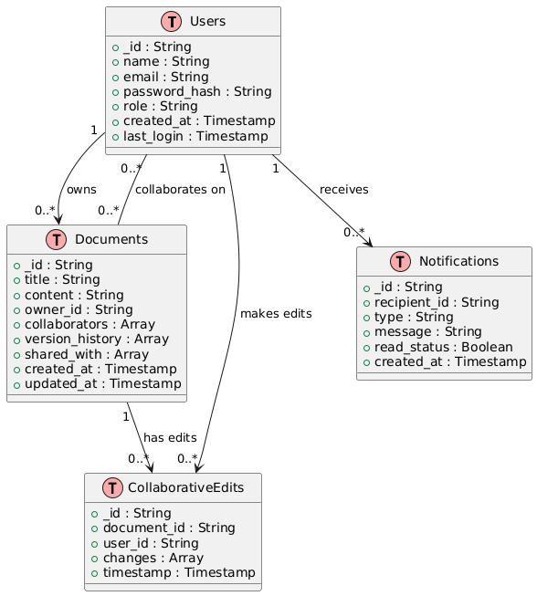

# Google Docs - Software Design Document

## 1. Introduction

### 1.1 Purpose
The purpose of this document is to provide a comprehensive design for the Google Docs system, detailing its architecture, database schema, and system components to ensure clarity and alignment among development teams.

### 1.2 Scope
Google Docs is a collaborative, cloud-based document management system that allows users to create, edit, share, and collaborate on documents in real-time. Key features include:

- **User functionalities:** Document creation, real-time collaboration, version management, and commenting.
- **Admin functionalities:** User management, monitoring activity, and maintaining system configurations.

### 1.3 Definitions, Acronyms, and Abbreviations
- **UI:** User Interface
- **API:** Application Programming Interface
- **S3:** Amazon Simple Storage Service
- **OAuth:** Open Authorization

---

## 2. System Overview

The system is a cloud-based, modular platform with three main layers:
1. **Presentation Layer:** User interface components for document management and collaboration.
2. **Business Logic Layer:** Backend services handling requests, document processing, and real-time updates.
3. **Data Layer:** Storage for documents, metadata, and logs.

---

## 3. Architectural Design

### 3.1 Architectural Style
The system employs a **client-server architecture** using RESTful APIs and WebSocket-based real-time communication. A microservices architecture ensures scalability and modularity.

### 3.2 System Components

#### **Frontend (Web Client)**
- Framework: React.js
- Responsible for:
  - Rendering the user interface
  - Managing real-time updates and API interactions
  - Supporting document editing, sharing, and dashboard functionalities

#### **Backend Services**
- **Authentication Service:** Handles user login, registration, OAuth, and session management.
- **Document Management Service:** Manages document CRUD operations, real-time collaboration, and versioning.
- **Notification Service:** Sends email and in-app notifications.
- **Analytics Service:** Tracks user activity and generates reports.

#### **Database**
- MongoDB: Primary data store for documents and user data.
- Redis: Cache for session management and collaborative editing.

#### **External Services**
- Google Drive API: Cloud storage for documents.
- Firebase Auth: Third-party authentication provider.
- Google Cloud Functions: Serverless execution of lightweight tasks.

---

## 4. Component Diagram
### Diagram
To be provided.

---

## 5. Data Design

### 5.1 Database Schema

#### **Users Collection**
| Field             | Type       | Description                           |
|-------------------|------------|---------------------------------------|
| _id               | String     | Unique identifier for the user        |
| name              | String     | User's name                           |
| email             | String     | User's email address                  |
| password_hash     | String     | Encrypted password                    |
| role              | String     | User role (e.g., admin/user)          |
| created_at        | Timestamp  | Timestamp of account creation         |
| last_login        | Timestamp  | Last login timestamp                  |

#### **Documents Collection**
| Field             | Type       | Description                           |
|-------------------|------------|---------------------------------------|
| _id               | String     | Unique identifier for the document    |
| title             | String     | Document title                        |
| content           | String     | Document content in HTML or JSON      |
| owner_id          | String     | User ID of the document owner         |
| collaborators     | Array      | List of user IDs with edit access     |
| version_history   | Array      | List of previous versions (timestamps, changes) |
| shared_with       | Array      | List of user IDs with view access     |
| created_at        | Timestamp  | Document creation timestamp           |
| updated_at        | Timestamp  | Last modified timestamp               |

#### **Collaborative Edits Collection**
| Field             | Type       | Description                           |
|-------------------|------------|---------------------------------------|
| _id               | String     | Unique identifier for the session     |
| document_id       | String     | Associated document ID                |
| user_id           | String     | User making the changes               |
| changes           | Array      | List of edit operations               |
| timestamp         | Timestamp  | Time of the edit                      |

#### **Notifications Collection**
| Field             | Type       | Description                           |
|-------------------|------------|---------------------------------------|
| _id               | String     | Unique identifier for the notification |
| recipient_id      | String     | User ID of the recipient              |
| type              | String     | Type of notification (e.g., comment, share) |
| message           | String     | Notification content                  |
| read_status       | Boolean    | Whether the notification was read     |
| created_at        | Timestamp  | Timestamp of notification creation    |

---

## 6. Interface Design

### 6.1 User Interfaces

#### **User Dashboard**
- Lists owned and shared documents
- Displays recent activity

#### **Admin Dashboard**
- Provides tools for managing users and monitoring system metrics

### 6.2 External Interfaces

#### **APIs**
- **Login Endpoint:** `/api/auth/login`
- **Document Endpoint:** `/api/documents`
- **Notification Endpoint:** `/api/notifications`

#### **Cloud Storage**
- Google Drive API for document uploads and downloads.

---

## 7. Detailed Design

### 7.1 Real-Time Collaboration
- Uses WebSocket for instant updates.
- Conflict resolution is managed using operational transforms.

### 7.2 Notifications
- **Email Service:** Sends account and activity updates.
- **In-App Notifications:** Alerts users of changes or comments.

---

## 8. Security Design
- **Authentication:** OAuth-based login through Firebase.
- **Data Encryption:** AES-256 for sensitive data.
- **Access Control:** Role-based access control (RBAC).

---

## 9. Non-Functional Requirements

1. **Scalability:** Supports 10,000+ concurrent users.
2. **Performance:** API response times under 200ms.
3. **Reliability:** 99.99% uptime.
4. **Security:** Regular vulnerability assessments to protect user data.

---

## 10. Appendix

### Glossary
- **CRUD:** Create, Read, Update, Delete
- **RBAC:** Role-Based Access Control
- **REST:** Representational State Transfer

### References
- [Google Docs API Documentation](https://developers.google.com/docs/api)
- [OAuth 2.0 Standard](https://oauth.net/2/)
