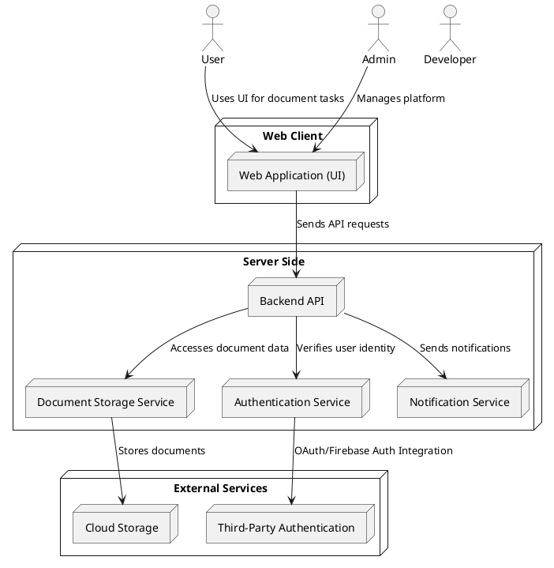
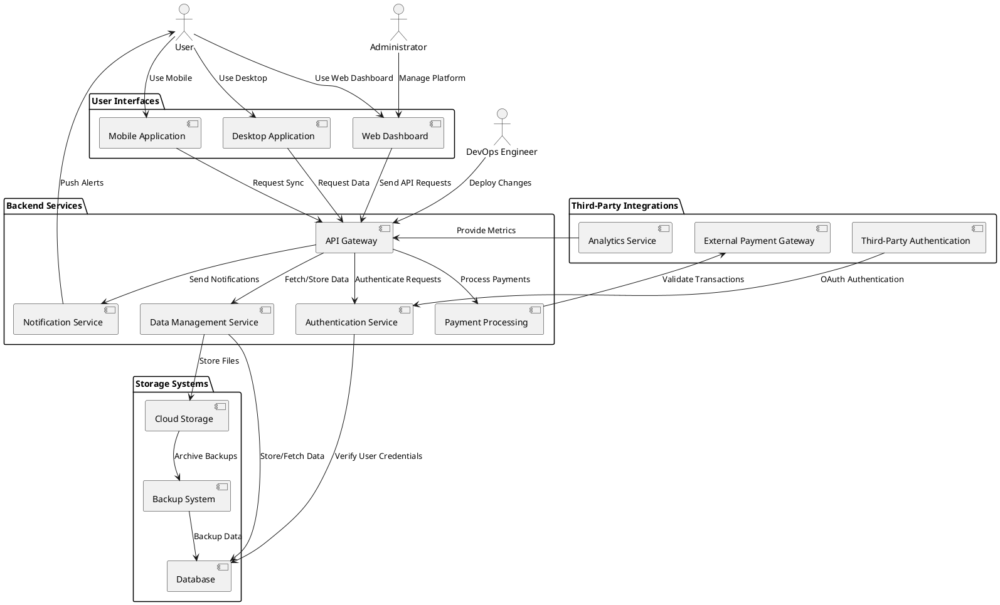
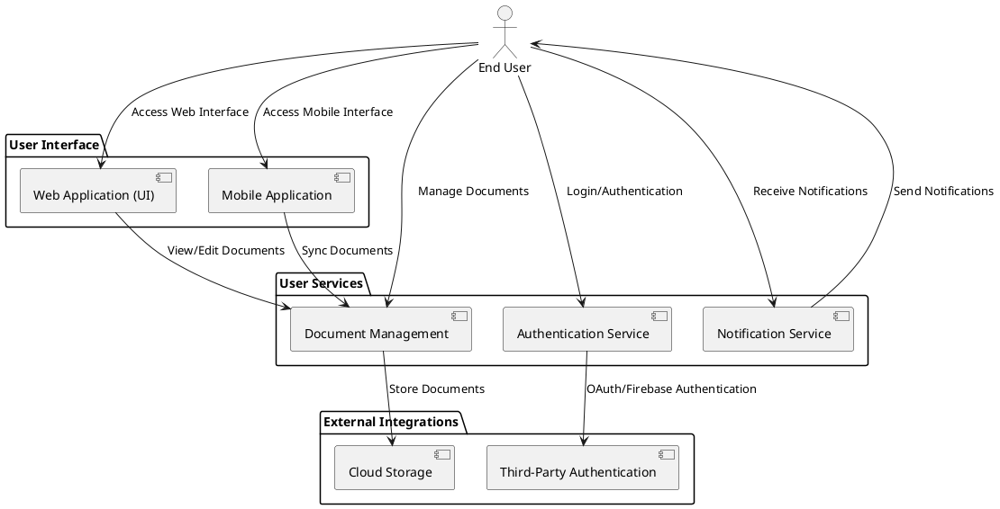
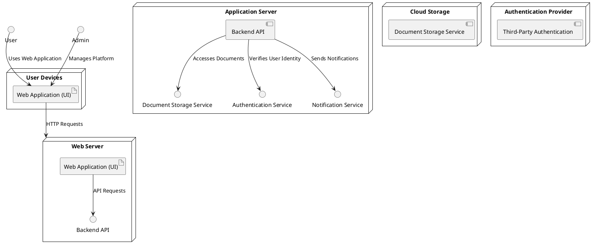

# System Context Diagram

```plantuml
@startuml
!define RECTANGLE class

actor User
actor Admin
actor Developer

package "Web Client" {
  RECTANGLE "Web Application (UI)" as WebApp {
    WebApp : User Interface
    WebApp : Document Creation
    WebApp : Real-Time Collaboration
    WebApp : File Sharing
    WebApp : Commenting and Suggestions
    WebApp : Version History
  }
}

package "Server Side" {
  RECTANGLE "Backend API" as BackendAPI {
    BackendAPI : Handles requests from WebApp
    BackendAPI : User Authentication
    BackendAPI : Document Management
    BackendAPI : Collaboration Sync
    BackendAPI : Commenting & Suggestion Handling
    BackendAPI : Version History Management
  }

  RECTANGLE "Document Storage Service" as DocStorage {
    DocStorage : Stores user documents
    DocStorage : Version History Storage
  }
```

# Container Diagram


### Admin 
```plantuml
@startuml
actor Admin

package "Admin Panel" {
    package "User Management" {
        class ViewEditDeleteUsers
        class RoleAssignment
        class InviteUsers
    }

    package "System Monitoring" {
        class ViewServerHealth
        class LogsAPIActivity
        class RealTimeUsageTracking
    }

    package "Document Management" {
        class ViewFlagDeleteDocuments
        class ManageVersionHistory
    }

    package "External Services" {
        class ConfigureCloudStorage
        class ManageAuthServices
    }

    package "Reporting & Analytics" {
        class GenerateActivityReports
        class ExportReports
    }

    package "Platform Settings" {
        class BrandingLogoTheme
        class FeatureToggles
        class EmailConfigurations
    }
}

Admin --> ViewEditDeleteUsers : Manages Users
Admin --> RoleAssignment : Assigns Roles
Admin --> InviteUsers : Sends Invitations

Admin --> ViewServerHealth : Monitors Server Health
Admin --> LogsAPIActivity : Reviews Logs
Admin --> RealTimeUsageTracking : Tracks Usage

Admin --> ViewFlagDeleteDocuments : Reviews Documents
Admin --> ManageVersionHistory : Manages Versions

Admin --> ConfigureCloudStorage : Configures Storage
Admin --> ManageAuthServices : Manages Auth Services

Admin --> GenerateActivityReports : Generates Reports
Admin --> ExportReports : Exports Reports

Admin --> BrandingLogoTheme : Customizes Branding
Admin --> FeatureToggles : Manages Features
Admin --> EmailConfigurations : Updates Email Settings
@enduml
```
# Component Diagram


### User Component

### Admin Component

```plantuml
@startuml
actor "Platform Admin" as Admin

package "Admin Panel" {
    [User Management] as UserManagement
    [Document Management] as DocManagement
    [System Monitoring] as SystemMonitoring
    [Platform Settings] as PlatformSettings
    [Reporting & Analytics] as ReportingAnalytics
    [External Services] as ExternalServices
}

' Relationships between Admin and components
Admin --> UserManagement : Manage Users
Admin --> DocManagement : Manage Documents
Admin --> SystemMonitoring : Monitor System Health
Admin --> PlatformSettings : Configure Platform Settings
Admin --> ReportingAnalytics : View Reports & Analytics
Admin --> ExternalServices : Configure Integrations

' User Management subsystem details
UserManagement --> [View/Edit/Delete Users] : Manage Users
UserManagement --> [Assign Roles] : Assign Roles
UserManagement --> [Invite Users] : Invite New Users

' Document Management subsystem details
DocManagement --> [View/Flag/Delete Documents] : Manage Documents
DocManagement --> [Version History] : View/Manage Version History

' System Monitoring subsystem details
SystemMonitoring --> [View Server Health] : Monitor Server Status
SystemMonitoring --> [API Logs] : Review API Logs
SystemMonitoring --> [Real-Time Usage Stats] : Monitor Real-Time Stats

' Platform Settings subsystem details
PlatformSettings --> [Branding Customization] : Configure Branding
PlatformSettings --> [Feature Toggles] : Manage Features
PlatformSettings --> [Email Configuration] : Configure Email Settings

' Reporting & Analytics subsystem details
ReportingAnalytics --> [Activity Reports] : Generate Reports
ReportingAnalytics --> [Export Reports] : Export Reports

' External Services subsystem details
ExternalServices --> [Cloud Storage Configurations] : Configure Cloud Storage
ExternalServices --> [Authentication Services] : Manage Authentication Services

@enduml
```

# Deployment Diagram


