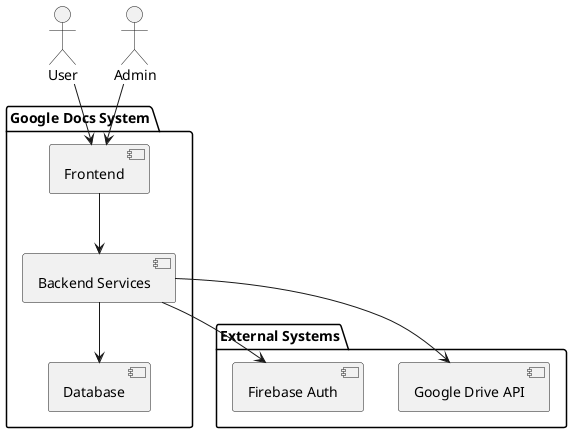
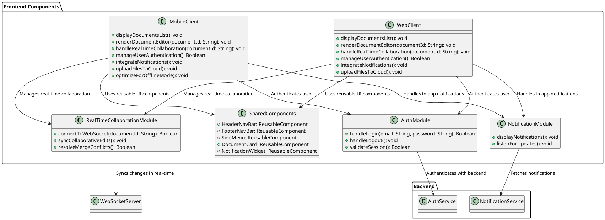
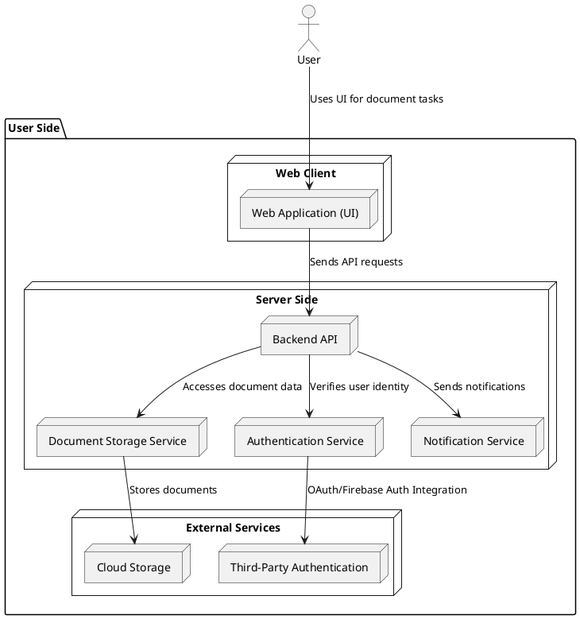
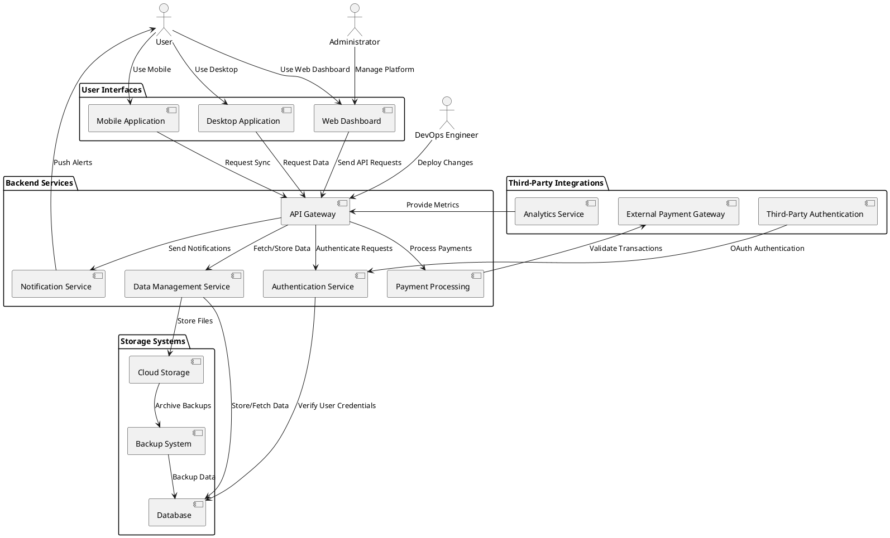
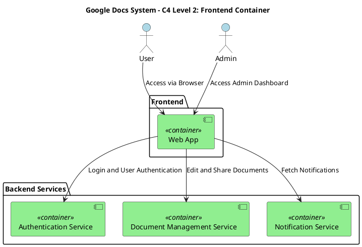
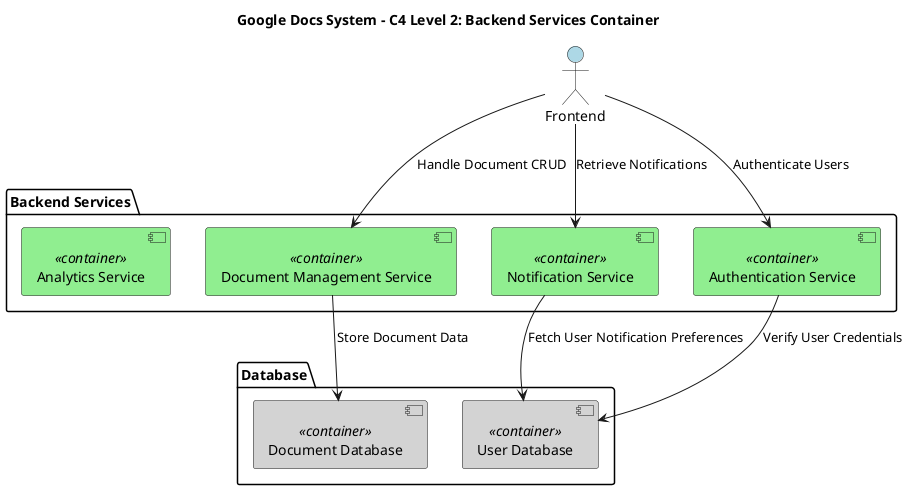
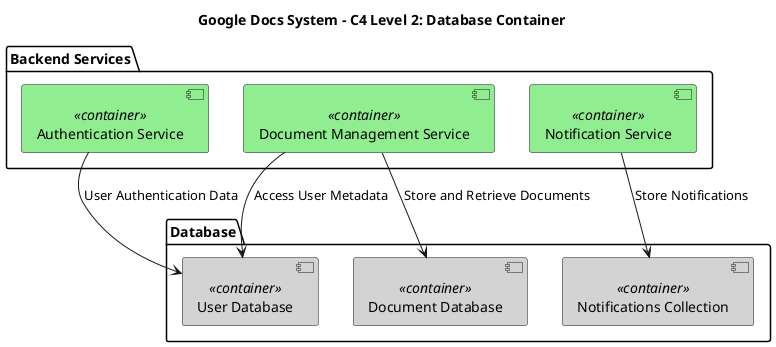

# System Context Diagram



# Container Diagram


### User

### Admin 
```plantuml
@startuml
actor Admin

package "Admin Panel" {
    package "User Management" {
        class ViewEditDeleteUsers
        class RoleAssignment
        class InviteUsers
    }

    package "System Monitoring" {
        class ViewServerHealth
        class LogsAPIActivity
        class RealTimeUsageTracking
    }

    package "Document Management" {
        class ViewFlagDeleteDocuments
        class ManageVersionHistory
    }

    package "External Services" {
        class ConfigureCloudStorage
        class ManageAuthServices
    }

    package "Reporting & Analytics" {
        class GenerateActivityReports
        class ExportReports
    }

    package "Platform Settings" {
        class BrandingLogoTheme
        class FeatureToggles
        class EmailConfigurations
    }
}

Admin --> ViewEditDeleteUsers : Manages Users
Admin --> RoleAssignment : Assigns Roles
Admin --> InviteUsers : Sends Invitations

Admin --> ViewServerHealth : Monitors Server Health
Admin --> LogsAPIActivity : Reviews Logs
Admin --> RealTimeUsageTracking : Tracks Usage

Admin --> ViewFlagDeleteDocuments : Reviews Documents
Admin --> ManageVersionHistory : Manages Versions

Admin --> ConfigureCloudStorage : Configures Storage
Admin --> ManageAuthServices : Manages Auth Services

Admin --> GenerateActivityReports : Generates Reports
Admin --> ExportReports : Exports Reports

Admin --> BrandingLogoTheme : Customizes Branding
Admin --> FeatureToggles : Manages Features
Admin --> EmailConfigurations : Updates Email Settings
@enduml
```
# Component Diagram


### Frontend Component


### Backend Component

### Database Component

### Container: External Systems


