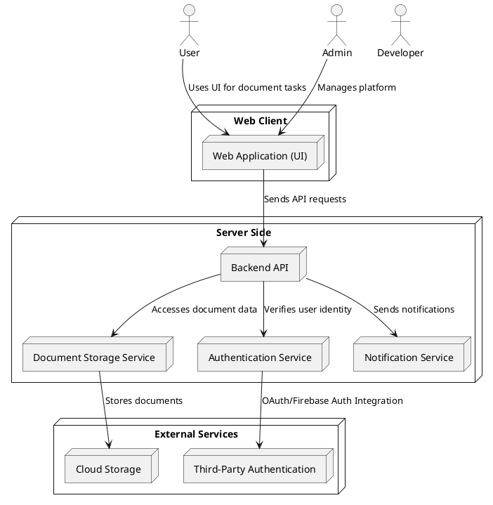

# System Context Diagram

```plantuml
@startuml
!define RECTANGLE class

actor User
actor Admin
actor Developer

package "Web Client" {
  RECTANGLE "Web Application (UI)" as WebApp {
    WebApp : User Interface
    WebApp : Document Creation
    WebApp : Real-Time Collaboration
    WebApp : File Sharing
    WebApp : Commenting and Suggestions
    WebApp : Version History
  }
}

package "Server Side" {
  RECTANGLE "Backend API" as BackendAPI {
    BackendAPI : Handles requests from WebApp
    BackendAPI : User Authentication
    BackendAPI : Document Management
    BackendAPI : Collaboration Sync
    BackendAPI : Commenting & Suggestion Handling
    BackendAPI : Version History Management
  }

  RECTANGLE "Document Storage Service" as DocStorage {
    DocStorage : Stores user documents
    DocStorage : Version History Storage
  }
```

# Container Diagram


# Component Diagram

```plantuml
@startuml
actor "User" as EndUser
actor "Administrator" as PlatformAdmin
actor "DevOps Engineer" as DevOps

package "User Interfaces" {
    [Desktop Application] as DesktopApp
    [Mobile Application] as MobileApp
    [Web Dashboard] as WebDashboard
}

package "Backend Services" {
    [API Gateway] as APIGateway
    [Authentication Service] as AuthService
    [Data Management Service] as DataService
    [Notification Service] as NotifyService
    [Payment Processing] as PaymentService
}

package "Storage Systems" {
    [Database] as Database
    [Cloud Storage] as CloudStorage
    [Backup System] as BackupSystem
}

package "Third-Party Integrations" {
    [Third-Party Authentication] as ThirdPartyAuth
    [External Payment Gateway] as PaymentGateway
    [Analytics Service] as AnalyticsService
}

EndUser --> DesktopApp : Use Desktop
EndUser --> MobileApp : Use Mobile
EndUser --> WebDashboard : Use Web Dashboard
PlatformAdmin --> WebDashboard : Manage Platform
DevOps --> APIGateway : Deploy Changes

DesktopApp --> APIGateway : Request Data
MobileApp --> APIGateway : Request Sync
WebDashboard --> APIGateway : Send API Requests
APIGateway --> AuthService : Authenticate Requests
APIGateway --> DataService : Fetch/Store Data
APIGateway --> NotifyService : Send Notifications
APIGateway --> PaymentService : Process Payments

AuthService --> Database : Verify User Credentials
DataService --> Database : Store/Fetch Data
NotifyService --> EndUser : Push Alerts
PaymentService --> PaymentGateway : Validate Transactions

BackupSystem --> Database : Backup Data
DataService --> CloudStorage : Store Files
CloudStorage --> BackupSystem : Archive Backups
AnalyticsService --> APIGateway : Provide Metrics
ThirdPartyAuth --> AuthService : OAuth Authentication
@enduml
