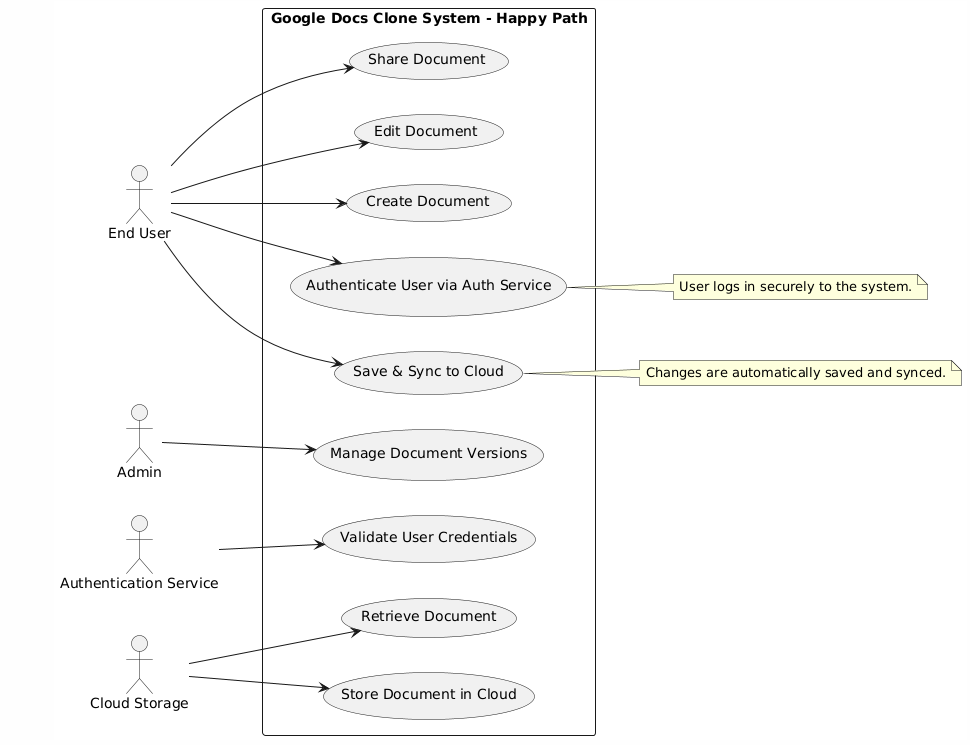
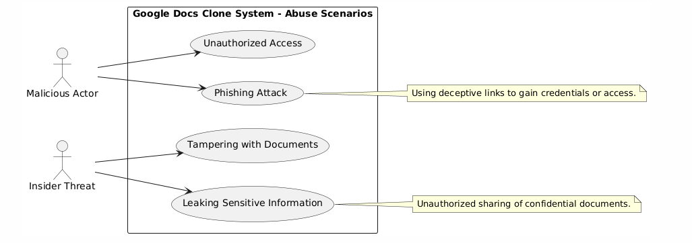
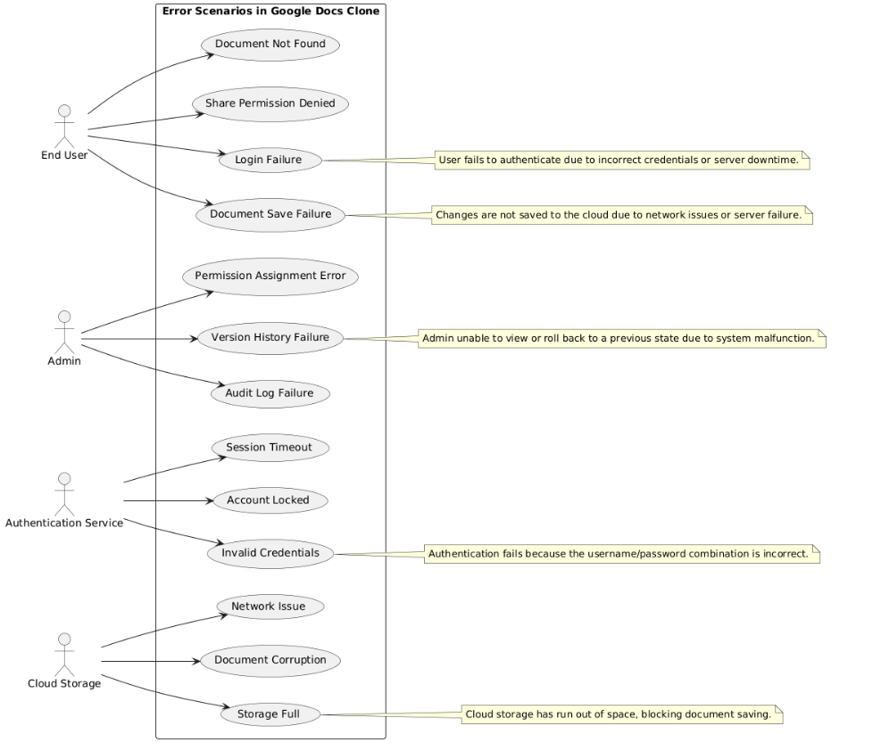

# SRS.md
## 1. Introduction
### 1.1 Purpose

This Software Requirements Specification (SRS) document provides a comprehensive overview of the requirements for the Google Docs clone application. It includes both functional and non-functional requirements and serves as a guideline for developers, testers, and stakeholders throughout the software development lifecycle.

### 1.2 Scope

The Google Docs clone application is a web-based document creation and collaboration platform. The system will support document creation, real-time collaboration, document sharing, and version control. This SRS covers all aspects of the application, including user interfaces, functional and non-functional requirements, and external interface requirements.

### 1.3 Definitions, Acronyms, and Abbreviations

- *SRS*: Software Requirements Specification
- *NFR*: Non-Functional Requirement
- *UI*: User Interface
- *API*: Application Programming Interface
- *RT*: Real-Time
- *CRUD*: Create, Read, Update, Delete

### 1.4 References

- IEEE Std 830-1998, IEEE Recommended Practice for Software Requirements Specifications
- SWEBOK v3.0, Software Engineering Body of Knowledge
- Stakeholders.md
- User Requirements Document

### 1.5 Overview

This document is organized into several sections that describe the overall system, functional requirements, non-functional requirements, and other considerations relevant to the development and implementation of the Google Docs clone application.

## 2. Overall Description

### 2.1 Product Perspective

The Google Docs clone application is a standalone web-based system designed for document creation and real-time collaboration. It will interface with external systems for cloud storage and authentication services. The system will use a modular architecture to enhance scalability and maintainability.

### 2.2 Product Functions

- *Document Creation and Editing*: Users can create and edit documents with a rich text editor.
- *Real-Time Collaboration*: Multiple users can collaborate on a document simultaneously with live updates.
- *Document Sharing and Permissions*: Users can share documents with different access levels.
- *Version History*: Users can view and revert to previous versions of a document.
- *Commenting and Suggestions*: Users can leave comments and make suggestions on documents.

### 2.3 User Classes and Characteristics

- *End Users*: Individuals using the application to create, edit, and collaborate on documents.
- *Administrators*: Users managing the platform, including user permissions and document access.
- *Developers*: Technical staff responsible for maintaining and enhancing the application.

### 2.4 Operating Environment

The application will operate on major web browsers (Chrome, Firefox, Safari, Edge) and will be compatible with both desktop and mobile devices. It requires an internet connection for full functionality, particularly for real-time collaboration and document sharing. Backend services will be hosted on cloud infrastructure for high availability and performance.

### 2.5 Design and Implementation Constraints

- *Data Protection*: The application must comply with data protection regulations such as GDPR and CCPA.
- *Browser Compatibility*: The application must be tested and optimized for compatibility with major web browsers.
- *Performance*: The application must handle multiple concurrent users and large documents efficiently.

### 2.6 Assumptions and Dependencies

- Users have access to modern web browsers and stable internet connections.
- Integration with cloud storage and authentication services is reliable and secure.
- The application will initially support only one language (e.g., English) and one currency (e.g., USD).

## 3. System Features

### 3.1 Document Creation and Editing

*Description*: Users can create and edit text documents using a rich text editor.

*Functional Requirements*:

- The system shall allow users to create new documents.
- The system shall provide basic text formatting options including font style, size, and color.
- The system shall support the insertion of images, tables, and hyperlinks.
- The system shall auto-save documents to prevent data loss.

### 3.2 Real-Time Collaboration

*Description*: Multiple users can edit the same document simultaneously with live updates.

*Functional Requirements*:

- The system shall enable real-time synchronization of changes made by multiple users.
- The system shall display presence indicators showing who is currently editing the document.
- The system shall handle simultaneous edits efficiently without data conflicts.

### 3.3 Document Sharing and Permissions

*Description*: Users can share documents and manage access permissions.

*Functional Requirements*:

- The system shall provide options to share documents via email or direct links.
- The system shall allow users to set access permissions (view, comment, edit) for collaborators.
- The system shall support both public and private sharing settings.
### 3.4 Version History

*Description*: Users can view and revert to previous versions of a document.

*Functional Requirements*:

- The system shall maintain a version history for each document.
- The system shall allow users to view and restore previous versions of a document.
- The system shall log changes made to documents in the version history.

### 3.5 Commenting and Suggestions

*Description*: Users can leave comments and suggestions on documents.

*Functional Requirements*:

- The system shall allow users to leave comments on specific parts of a document.
- The system shall enable users to make suggestions that can be accepted or rejected.
- The system shall provide notifications for comments and suggestions.

## 4. External Interface Requirements

### 4.1 User Interfaces

- *Web Application*: The UI will be intuitive and responsive, offering easy navigation and access to key functionalities across various screen sizes.
- *Admin Panel*: A web-based admin panel will provide a comprehensive dashboard for managing users, documents, and permissions.

### 4.2 Hardware Interfaces

- The system will interact with the following hardware on user devices:
    - *Cameras*: For profile pictures or document images.
    - *Microphones*: Optional for voice input features if integrated.

### 4.3 Software Interfaces

- *Third-Party APIs*: Integration with APIs for cloud storage services and authentication.
- *Database*: The system will use a NoSQL database (e.g., MongoDB) for data storage and retrieval

## 5. Non-Functional Requirements (NFRs)

### 5.1 Performance Requirements
- The application shall load within 3 seconds on normal networks (10 Mbps for desktops, 4G LTE for mobile).  
- Editing and saving latency shall not exceed 300 ms.  
- Support for 1,000 concurrent document collaborators without performance degradation.  
- Autosave changes within 1 second of user action.  

### 5.2 Security Requirements
- Encrypt data in transit (TLS) and at rest (AES-256).  
- Support multi-factor authentication (MFA).  
- Control document access with permission settings.  
- Conduct regular security audits and penetration testing.  
- Session tokens expire after 30 minutes of inactivity.  

### 5.3 Availability and Reliability
- Achieve 99.9% uptime with autosave and recovery features.  
- Hourly data backups with redundancy across data centers.  
- Implement automatic failover for server failures.  

### 5.4 Scalability
- Support horizontal and vertical scaling.  
- Allow 1,000 simultaneous document collaborators without degradation.  
- Optimize the database for high-speed transactions and storage.  

### 5.5 Usability
- Ensure intuitive navigation and accessibility per WCAG 2.1.  
- Show real-time collaboration updates within 1 second.  
- Integrate user feedback mechanisms for continuous improvement.  

### 5.6 Maintainability
- Modular codebase for easy updates.  
- Maintain comprehensive documentation and automated tests (90% coverage).  
- Include robust logging and monitoring for issue resolution.  

### 5.7 Compliance
- Comply with GDPR, CCPA, and other regulations.  
- Implement audit trails for document collaboration.  
- Adhere to PCI-DSS for payment processing.  
- Enable data export and deletion per privacy laws.  

## 6. Other Requirements
- **Localization:** Support regional interface and language settings.  
- **Ethical Requirements:** Respect user privacy with clear consent for monitoring features.  

## 7. Use Case Diagram

### Happy Path Diagram
The **Happy Path** diagram outlines the standard, error-free interaction flows in the **Google Docs Clone System**. It represents the smooth sequence of operations without any failures or exception scenarios:

**Actors**:  
- **End User**: Authenticates, creates documents, edits, collaborates in real-time, shares documents, and saves changes to cloud storage.  
- **Admin**: Manages versions, monitors activity logs, and oversees administrative operations.  
- **Authentication Service**: Authenticates users and validates credentials.  
- **Cloud Storage**: Handles document saving, retrieval, and synchronization.
  
---

### Abuse Case Diagram
The **Abuse Case** diagram explores malicious or unintended misuse of the **Google Docs Clone System**, focusing on security risks and insider threats:

**Actors**:  
- **Hacker**: Conducts phishing attacks and unauthorized access attempts.  
- **Insider Threat**: Leaks sensitive documents, tamper with data, or shares confidential documents with unauthorized users.

---

### Error Case Diagram
The **Error Case** diagram depicts the possible failure paths and their causes when interacting with the **Google Docs Clone System**. It highlights how system malfunctions, network errors, and authentication failures affect system operations:

**Actors**:  
- **End User**: Faces login failures, document save errors, permission denial, and document unavailability.  
- **Admin**: Experiences version history failures, audit log issues, and permission assignment errors.  
- **Authentication Service**: Handles failures like invalid credentials, session timeouts, and locked accounts.  
- **Cloud Storage**: Deals with storage failures, document corruption, and network-related issues.

---
